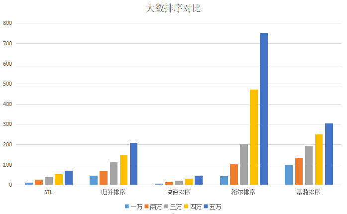
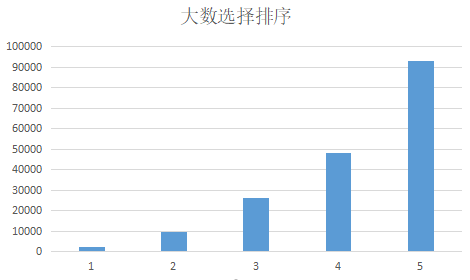
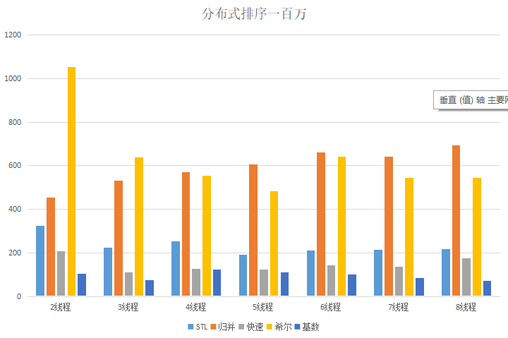
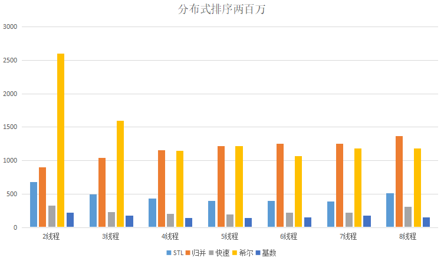
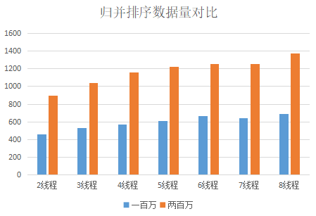
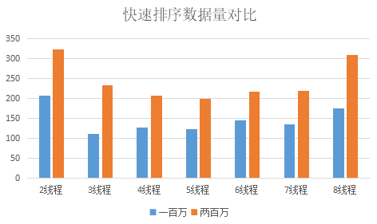
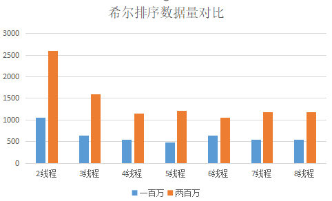
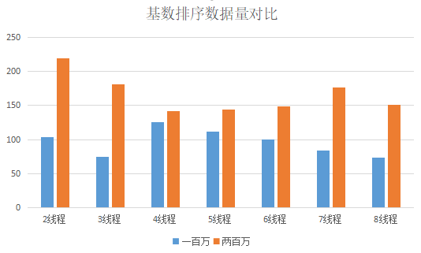
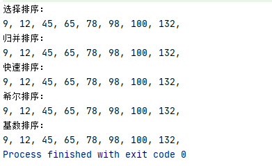
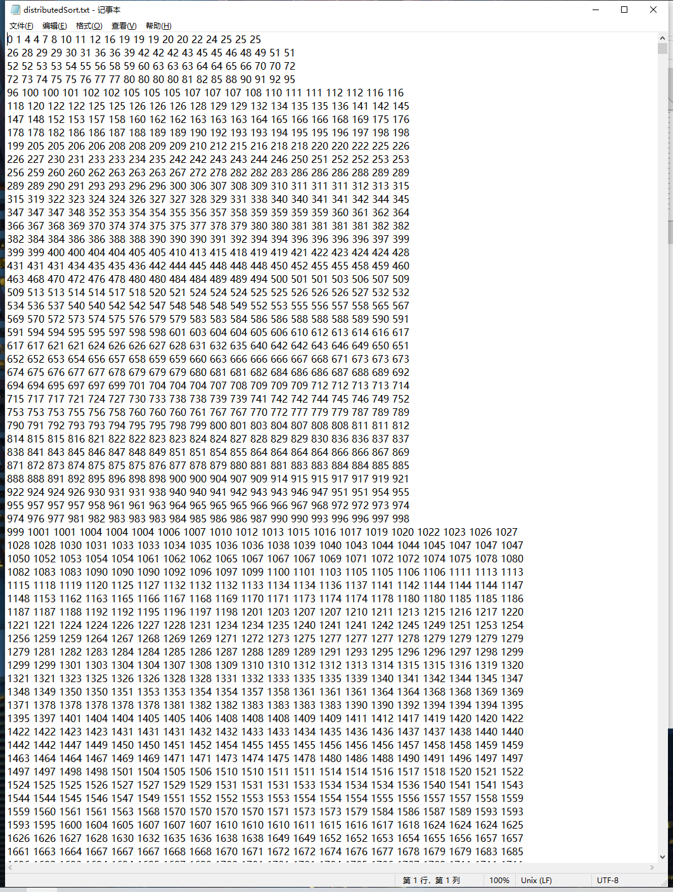

# SortAlgorithm-程序设计与算法大作业
## 使用说明
1.选择参加排序的算法(默认选择排序不参与)         
&emsp;-a <选择的算法>    &emsp; // 写相应的算法代号：选择排序代号1，归并排序代号2，快速排序代号3，归并排序代号4，基数排序代号5       
&emsp;例如全部算法参与排序：      


2.数组操作    
（1）选择数组长度（默认10000）   
&emsp;&emsp;&emsp;-n <数组长度>    &emsp;//n后面写数组长度     
&emsp;例如数组长度为100000：     


（2）选择初始数组状态（默认乱序）    
&emsp;&emsp;&emsp;-d r   &emsp; //乱序       
&emsp;&emsp;&emsp;-d a   &emsp; //升序      
&emsp;&emsp;&emsp;-d d   &emsp;//降序       
&emsp;例如选数组初始状态为升序：    


3.大数版本   
&emsp;-h   &emsp;  //启用大数    

4.多线程版本   
&emsp;-t <线程数>      

5.启用输出        
&emsp;-o     


<br /><br />
## 常规版本 
### 一、实现这五种排序并分析        
#### 1. 选择排序   
基本思想                              
&emsp;&emsp;每一趟排序待排序序列中选出最小的元素，(先假设第一个元素是最小的，遍历后面的元素，不断记录更小的元素下标，即可得到一趟遍历中最小元素)然后与该未排序序列的第一个元素交换位置，确定该元素的位置，如此重复直到所有元素排序完成。  
       
  时间复杂度     
 &emsp;&emsp; 一趟排序的比较次数是0(n)，重复n-1趟，所以时间复杂度是0(n^2)。

主要代码       
```c++
	template<typename T>
	void SelectSort(T* arr, int n)                //选择排序入口
	{
		for (int i = 0; i < n; ++i)
		{
			for (int j = i + 1; j < n; ++j)
			{
				if (arr[j] < arr[i])
					std::swap(arr[i], arr[j]);
			}
	    }
	}
```
<br /><br />


#### 2. 归并排序   
 基本思想        
&emsp;&emsp; 先将最初长度为n的待排序序列从中间划分成两个子序列，再递归划分左右两个子序列，形成 n个长度为1的有序子序列 。再将相邻的两个子序列两两合并，形成有序序列，如此重复最后得到长度为n的有序序列。     
&emsp;&emsp; 一趟合并的过程：借助一个临时数组，比较待合并的左右两个序列的第一个元素大小，将较小的赋值给临时数组，直到两个子序列的元素都完成合并。     

 时间复杂度  
&emsp;&emsp; 归并排序的时间复杂度为归并的趟数与每一趟归并的时间的复杂度的乘积。子算法merge合并的时间复杂度为0(n),趟数为log₂n ,故算法复杂度为0(nlogn)。

主要代码          
```c++
	template<typename T>
	void MergeSort(T* arr, int n)                 //归并排序入口
	{
		if (n <= 1) return;
		int mid = n / 2;
		MergeSort(arr, mid); // [0, mid - 1]
		MergeSort(arr + mid, n - mid); // [mid, n - 1]
		T* temp = new T[n + 1];
		int p = 0, q = mid;
		for (int i = 0; i < n; ++i)
		{
			if (p >= mid) temp[i] = arr[q++];
			else if (q >= n) temp[i] = arr[p++];
			else temp[i] = arr[q] < arr[p] ? arr[q++] : arr[p++];
		}
		memcpy(arr, temp, n * sizeof(T));
		delete[] temp;
	}
```
<br /><br />


#### 3. 快速排序   
基本思想    
&emsp;&emsp;  从当前待排序序列中选择最后一个元素作为主元，把小于等于主元的所有元素移动到主元前边，大于等于基准元素的所有元素都移动到主元后边，确定主元的最终位置，然后分别对前后两个序列递归上述过程，直到所有元素完成排序。

时间复杂度  
&emsp;&emsp; 快排一趟排序确定一个元素的位置，时间复杂度为O(n)，在平均情况下递归趟数为log₂n ，算法复杂度为0(nlogn)。在序列已经有序的情况下，需要重复n-1趟才能确定所有元素的位置，时间复杂度为0(n^2)。


主要代码       
```c++
	template<typename T>
	void QuickSort(T* arr, int n)                 //快速排序入口
	{
		if (n <= 1) return;
		int t = (rand() << 15) | rand();
		t %= n;
		std::swap(arr[0], arr[t]);
		int p = 1, q = n; //pq指向最后一个小于等于arr[0]的后一个
		while (p < q)
		{
			while (p < q && arr[p] <= arr[0]) ++p;
			while (q == n || (p < q && arr[q] > arr[0])) --q;
			if (p < q) std::swap(arr[p], arr[q]);
		}
		std::swap(arr[0], arr[p - 1]);
		QuickSort(arr, p - 1);
		QuickSort(arr + p, n - p);
	}
```
<br /><br />


#### 4. 希尔排序   
基本思想    
&emsp;&emsp;首先确定元素间隔数gap，然后将所有位置相隔gap的元素视为一个子序列，对各个子序列进行排序；然后缩小间隔数，并重新对形成的子序列进行排序，直到gap = 1。              &emsp;&emsp;      
&emsp;&emsp;这里初始gap设为n/2，每次缩小一半。子序列内部采用冒泡排序。

时间复杂度     
&emsp;&emsp;希尔排序的排序趟数为log₂n；当子序列分的越多时，子序列内的元素就越少，元素比较交换次数就越少，而当子序列的个数减少时，整个序列接近有序，子序列的元素虽然变多但元素之间的比较交换次数没有随之变多。所以一般情况下，认为希尔排序的时间复杂度在0(nlogn)与0(n^2)之间。

主要代码         
```c++
	template<typename T>
	void ShellSort(T* arr, int n)                //希尔排序入口
	{
		int gap, i, j, flag;
	    //外循环以不同的gap值对形成的序列进行排序，直到gap=1 
	    for(gap = n / 2; gap >= 1; gap = gap / 2)
		{
			//对各个子序列进行冒泡排序 
			do{
				flag = 0; 
				for(i = 0; i < n - gap; i++)
				{
					j = i + gap;
					if(arr[i] > arr[j])
					{
						std::swap(arr[i], arr[j]);
						flag = 1;
					}	
				}		
			} while (flag);
	    }	
	}
```
<br /><br />
#### 5. 基数排序   
基本思想       
&emsp;&emsp;把参加排序的序列中的的元素按第1位的值进行排序（最右边一位为第1位)，然后再按第2位的值进行排序......最后按第d位的值进行排序。每一趟排序过程中若有元素的位值相同，则它们之间仍保留前一趟排序的次序。    
&emsp;&emsp;具体实现借助链表 ，假设参加排序的序列是d位r进制，不足d位的元素在前面补上0。       

 时间复杂度          
 &emsp;&emsp;基数排序的趟数是d趟，每趟要把n个元素依次分配到r个分队，再集合到总队，每趟花费的时间为0(n+r）。所以基数排序总的时间复杂度为0(d(n+r))。
     
 主要代码     
```c++
void Sort::RadixSort(int* arr, int n) //普通基数排序
{
	static const int BASE = 1500;

	int min = arr[0], max = arr[0];
	for (int i = 1; i < n; ++i)
	{
		min = arr[i] < min ? arr[i] : min;
		max = arr[i] > max ? arr[i] : max;
	}
	for (int i = 0; i < n; ++i) arr[i] -= min;
	max -= min;

	auto head = new Node<int>[BASE + 1];
	auto tail = new Node<int>*[BASE + 1];
	auto node = new Node<int>[n + 1];
	for (int i = 1; i < max; i *= BASE)
	{
		memset(head, 0, sizeof(Node<int>) * BASE);
		memset(tail, 0, sizeof(Node<int>*) * BASE);
		for (int j = 0; j < n; ++j)
		{
			int t = arr[j] / i % BASE;
			node[j] = {arr[j], NULL};
			if (head[t].next == NULL) head[t].next = &node[j];
			if (tail[t] != NULL) tail[t]->next = &node[j];
			tail[t] = &node[j];
		}
		int p = 0;
		for (int j = 0; j < BASE; ++j)
		{
			auto t = &head[j];
			while (t = t->next)
			{
				arr[p++] = t->val;
			}
			head[j].next = NULL;
			tail[j] = NULL;
		}
	}
	delete[] head;
	delete[] tail;
	delete[] node;

	for (int i = 0; i < n; ++i) arr[i] += min;
}
```
  <br /><br /><br />

  

### 二、分析其在不同规模的输入下单机性能变化情况      
#### 1.  初始数组次序对排序性能影响    
 &emsp;&emsp; 分析五种排序算法在初始数组次序分别为乱序，升序，降序情况下的性能变化情况 ，这里固定数组长度为100000。      
 <br />

 实验结果：如下表所示，单位ms

| 原始次序 | 乱序 | 升序 |降序 |
 | :----: | :----: | :----: | :----: |
| 选择排序 | 77544 |7819 |119805 | -- |
| 归并排序 |36| 27 | 28|  |
| 快速排序 | 27 | 11 |15|  |
| 希尔排序 | 134| 2 | 26 |  |
| 基数排序 | 9 | 6 | 6 |  |         

性能分析        
&emsp;&emsp;(1)当原始数组为升序时，五种排序算法的运行时间较乱序均有降低，其中希尔排序性能提升最为明显，选择排序其次。       
&emsp;&emsp;&emsp;因为原始序列的次序与排序结果一致，排序算法的交换次数均减少，运行时间也随之减少；其中希尔排序各个子序列已经升序，比较次数也减少，大大减少了排序时间，性能提升最为明显。

&emsp;&emsp;(2) 当原始数组为降序时，选择排序的时间上升，其余四种排序时间均降低。         
&emsp;&emsp;&emsp;这是因为选择排序每次假设待排序序列的第一个元素为最小值，增加了交换次数。而其余四种排序的交换次数均减少，所以运行时间也随之减低。

&emsp;&emsp;(3) 从实验结果可知，当数组长度较长时，元素之间的交换次数对运行时间的影响占主导地位，所以原始数组有序（正序或逆序）情况下归并、快排、希尔、和基数排序耗时均减少。
<br /><br />    

#### 2.  不同规模的输入下性能分析  
 &emsp;&emsp;生成不同长度n=1000,n=10000,n=100000,n=100000的数组，计时 ，分别统计这五种排序算法在不同数组长度下随机实验10次的平均运行时间，这里以乱序数组为例。     
 <br />
实验结果：如下表所示，单位ms

| 输入规模 | n=1000 | n=10000 |n=100000 |n=1000000|
| :----: | :----: | :----: | :----: |:----: |
| 选择排序 | 7 | 757 |77544 | -- |
| 归并排序 |0 | 4 | 36| 353 |
| 快速排序 | 0 | 2 |27| 283 |
| 希尔排序 | 0| 8 | 134 | 2264 |
| 基数排序 | 0 | 0 | 9 | 147 |
<br />

性能分析        
&emsp;&emsp;从实验结果来看，这五种排序耗时从小到大为：基数排序<归并排序和快速排序（一个数量级）<希尔排序<选择排序   
&emsp;&emsp;(1)  快速排序和归并排序在不同输入规模下耗时相近，属于同一个数量级。    
&emsp;&emsp;(2)  希尔排序的耗时 在归并/快排和选择排序之间，但更接近归并/快排，所以时间复杂度更接近0(nlogn)。  
&emsp;&emsp;(3)在输入规模在1000及以下时，五种排序算法用时差别不明显；而输入规模每增大10倍，选择排序耗时增大近似100倍，所以随着输入规模的增大，时间差异越发明显，在输入规模达到百万数量级时，很难运行出结果。
<br /><br />       

#### 3.  总结
| 排序算法 | 平均时间 |稳定性 |备注
 | :----: | :----: | :----: | :----: 
| 选择排序 | O(n^2) | 不稳定 |n小时较好|
| 归并排序 |O(nlogn)  | 稳定 |n大时较好 | 
| 快速排序 | O(nlogn) | 不稳定 | n大时较好 | 
| 希尔排序 |O(nlogn)  | 不稳定 | 更接近O(nlogn)
| 基数排序 | O(d(n+r)) | 稳定 | d 是位数，r是进制 | 

 <br /><br /><br />


## 大数版本

#### 大数排序实现

```C++
// 详见代码
class HugeInt;
class HugeIntDataProvider;
class Sort;
```

#### 大数的存储方式

 &emsp;&emsp; 以10000为基准，使用int[20]的数组存储一个大数，每一个int存储0~9999的一个数，高位数字表示成10000的n次进位，这样仅仅使用长度为20的int数组即可表示10的100次方这样大的数字。

 &emsp;&emsp; 自定义数据类型，实现其比较方法，此处例举大数对象的定义：

```c++
class HugeInt
{
public:
	static const int ARR_SIZE = 20;
	static const int BASE = 100000;

	static HugeInt Zero();
	static HugeInt Rand();

	HugeInt();
	//HugeInt(const char* str);
	~HugeInt();

	bool absEqualTo(const HugeInt&) const;
	bool absLessThan(const HugeInt&) const;
	bool operator==(const HugeInt&) const;
	bool operator!=(const HugeInt&) const;
	bool operator<(const HugeInt&) const;
	bool operator<=(const HugeInt&) const;
	bool operator>(const HugeInt&) const;
	bool operator>=(const HugeInt&) const;
	int getData(int i) const;
	const char* toString();

private:
	int sig; //1: 非负数  0: 负数
	int* data;
	char* str;

	void makeString();
};
```

#### 对大数排序的性能分析

各算法在一万到五万数据量下，排序耗时统计（单位ms）：

|      | STL  | 归并排序 | 快速排序 | 希尔排序 | 基数排序 | 选择排序 |
| ---- | ---- | -------- | -------- | -------- | -------- | -------- |
| 一万 | 12   | 45       | 7        | 43       | 101      | 2312     |
| 两万 | 26   | 68       | 15       | 105      | 132      | 9714     |
| 三万 | 38   | 116      | 21       | 203      | 191      | 26351    |
| 四万 | 54   | 146      | 31       | 471      | 250      | 48497    |
| 五万 | 70   | 208      | 46       | 754      | 304      | 93056    |

各个版本的大数排序耗时分布如下图，数据量从一万到五万。



选择排序由于耗时太久，单独进行展示，数据量从一万到五万。




## 分布式排序

#### 分布式排序实现

```C++
// 详见代码
class SortAlgorithm;
```

#### 分布式排序算法分析

 &emsp;&emsp; 对于小规模数据量的数据进行排序和运算，其需要的内存容量，核心性能，和运算时间；单机的性能就可以满足。

 &emsp;&emsp; 对于超大规模量的数据进行排序和运算，往往单机的性能无法满足其需要；需要多台机器分别对数据的某一部分进行排序，最后进行数据的合并排序来完成大体量数据的排序运算。

 &emsp;&emsp; 真实环境中的分布式运算即将任务进行切片，分发给不同的核心进行计算；可以在单机中使用多线程来模拟分布式排序运算；最终都需要将多个线程运算的结果进行汇总排序。

#### 分布式算法耗时

数据量为一百万时，耗时统计（单位ms）：

|       | STL  | 归并 | 快速 | 希尔 | 基数 |
| ----- | ---- | ---- | ---- | ---- | ---- |
| 2线程 | 323  | 455  | 208  | 1054 | 103  |
| 3线程 | 223  | 532  | 111  | 639  | 75   |
| 4线程 | 254  | 570  | 127  | 554  | 125  |
| 5线程 | 193  | 607  | 122  | 482  | 112  |
| 6线程 | 211  | 661  | 144  | 643  | 100  |
| 7线程 | 214  | 643  | 135  | 544  | 84   |
| 8线程 | 218  | 692  | 176  | 546  | 73   |

源数据为一百万条时，各算法耗时分布：



源数据为两百万条时，各算法耗时分布：



各个版本排序方法分别在不同数据量的情况下，排序耗时分布如图：









选择排序由于耗时太长，一百万4线程耗时高达949394ms，没有参加本次排序耗时对比。

测试环境：CPU核心数为4，内存16G


## Java语言实现常规和分布式排序（简易版）

#### 常规版排序算法实现

```Java
// 详见代码
public class MergeSort;
public class QuickSort;
public class RadixSort;
public class SelectionSort;
public class ShellSort;
```

直接在IDE中运行调试，其中常规排序算法在IDE调试控制台打印结果：



#### 分布式排序实现

```java
public class DateOperator; // 生产数据和汇总后写入文件
public class DistributedSort; // 多线程调用排序算法进行排序
```

使用多线程模拟进行分布式排序
单线程处理十五万条数据，分10个线程，共150万条数据
使用CountDownLatch，限定在所有线程执行结束后再进行汇总和写入文件
排序后的结果存储在distributedSort.txt中。



